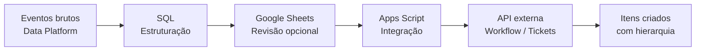

# Alert to Workflow Pipeline

Pipeline para transformar eventos analíticos em itens operacionais estruturados em ferramentas de gestão (ex: Jira).

O projeto conecta um ambiente analítico (ex: Databricks), uma camada intermediária (Google Sheets) e um sistema de workflow, permitindo que insights gerados por dados sejam convertidos automaticamente em tarefas auditáveis.

---

## 📌 Problema

Em muitos cenários, eventos detectados em bases analíticas (alertas, anomalias, regras de negócio) exigem ação manual:

* Consolidação de dados
* Verificação de histórico
* Criação manual de tickets
* Preenchimento repetitivo de campos

Esse processo é lento, sujeito a erro e pouco escalável.

---

## ⚙️ Solução

Este projeto implementa um fluxo automatizado:

1. **Detecção (SQL / Data Platform)**

   * Identifica eventos relevantes
   * Enriquece com contexto (classificação, histórico, flags)
   * Estrutura os dados em formato de importação

2. **Intermediação (Google Sheets)**

   * Permite revisão humana opcional
   * Atua como camada de controle e auditoria

3. **Execução (Apps Script + API)**

   * Cria itens em sistemas de workflow
   * Mantém hierarquia entre registros (pai/filho)
   * Preenche campos automaticamente

---

## 🔁 Fluxo

Data Platform → Sheet → API → Sistema de Workflow

---

## 🧠 Principais capacidades

* Estruturação hierárquica (item principal + subitens)
* Deduplicação e agrupamento por entidade
* Enriquecimento com histórico e classificação
* Criação automatizada de tarefas via API
* Mapeamento dinâmico de responsáveis
* Redução massiva de esforço operacional

---

## 📊 Modelo de dados (genérico)

| Campo         | Descrição                           |
| ------------- | ----------------------------------- |
| tipo_item     | Tipo do item (principal/subitem)    |
| entidade_id   | Identificador da entidade           |
| resumo        | Título do item                      |
| data_evento   | Data do evento                      |
| prioridade    | Prioridade                          |
| status        | Status inicial                      |
| parent        | Referência ao item pai              |
| classificacao | Classificação de risco ou categoria |
| flag_especial | Indicador derivado de regra         |
| descricao     | Detalhamento                        |

---

## 🚨 Casos de uso

* Alertas de risco / fraude
* Monitoramento de anomalias
* Operações de suporte automatizadas
* Processos de compliance
* Qualquer fluxo data → ação

---

## 📂 Estrutura

```bash
sql/            → Geração dos dados estruturados
apps_script/    → Integração com API de workflow
docs/           → Documentação técnica
data_sample/    → Exemplo de saída
```

---

## 🧩 Arquitetura do fluxo



---

## 🔍 Descrição

* **Data Platform:** detecta eventos relevantes
* **SQL:** organiza e enriquece os dados
* **Sheets:** permite controle operacional
* **Apps Script:** executa integração com API
* **Sistema final:** recebe itens estruturados e acionáveis

---

## 🔄 Input vs Output

### Entrada (camada analítica)

Eventos brutos detectados na base:

```id="inp1"
entity_id,event_name,event_date,classification
123,Transação acima do padrão,2026-03-01,HIGH
123,Volume atípico mensal,2026-03-01,HIGH
456,Frequência incomum,2026-03-01,LOW
```

---

### Saída (estrutura operacional)

Dados estruturados para integração com sistemas de workflow:

```id="out1"
tipo_item,resumo,parent,classificacao,flag_especial
ITEM_PRINCIPAL,Cliente 123,,HIGH,YES
SUBITEM,Transação acima do padrão,Cliente 123,HIGH,YES
SUBITEM,Volume atípico mensal,Cliente 123,HIGH,YES

ITEM_PRINCIPAL,Cliente 456,,LOW,NO
SUBITEM,Frequência incomum,Cliente 456,LOW,YES
```

---

## 🧠 O que acontece na transformação

* Eventos são **agrupados por entidade**
* Um **item principal** é criado para cada entidade
* Cada evento vira um **subitem**
* Flags e classificações são **derivadas automaticamente**
* A hierarquia é construída via campo `parent`

---

## 🎯 Resultado

Uma estrutura pronta para:

* Criação automática de tarefas
* Organização hierárquica (pai/filho)
* Priorização baseada em dados
* Rastreabilidade completa

---

## ⚠️ Observações

* Adaptável para qualquer sistema com API (Jira, ServiceNow, etc.)
* Campos customizados podem variar por implementação
* Estrutura projetada para alta escalabilidade
